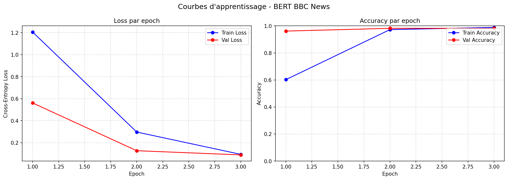
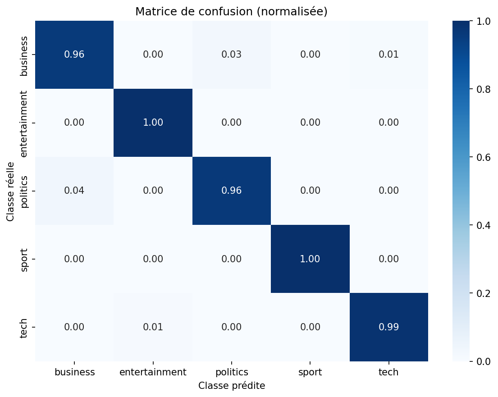

# BBC News Category Classifier — Fine-tuning de BERT

> **Devoir Pratique n°3 — NLP avec PyTorch**  
> Classification de texte : Fine-tuning de BERT  
> Niveau Master / Ingénierie IA — NLP & Deep Learning

---

## 👥 Membres du binôme

| Membre               | GitHub           |
| -------------------- | ---------------- |
| Kéléfing GOMINA      | @kgomina         |
| Samba Abaladema WELA | @Picatou01072017 |

---

## 🖥️ Environnement d'entraînement

L'entraînement a été réalisé sur **Google Colab** avec un GPU **Tesla T4 (15 Go VRAM)**.

| Paramètre          | Valeur                       |
| ------------------ | ---------------------------- |
| Plateforme         | Google Colab (gratuit)       |
| GPU                | NVIDIA Tesla T4 — 15 Go VRAM |
| CUDA               | 12.x                         |
| Python             | 3.12                         |
| PyTorch            | 2.x                          |
| Transformers       | 4.x (Hugging Face)           |
| Durée entraînement | ~15 minutes (3 epochs)       |

> **Pourquoi Colab ?** Le fine-tuning de BERT sur CPU est extrêmement lent (~2h par epoch). Google Colab offre un GPU gratuit qui réduit ce temps à ~5 minutes par epoch, ce qui est indispensable pour ce type de modèle (~110M paramètres).

---

## 📂 Dataset : BBC News

| Propriété             | Valeur                             |
| --------------------- | ---------------------------------- |
| **Source**            | BBC News (fourni par l'enseignant) |
| **Total d'exemples**  | 2 225 articles                     |
| **Nombre de classes** | 5                                  |
| **Langue**            | Anglais                            |
| **Séparateur CSV**    | Tabulation (`\t`)                  |

### Distribution des classes

| Classe        | Exemples | %      |
| ------------- | -------- | ------ |
| sport         | 511      | 22.97% |
| business      | 510      | 22.92% |
| politics      | 417      | 18.74% |
| tech          | 401      | 18.02% |
| entertainment | 386      | 17.35% |

> **Pas de déséquilibre** significatif (ratio max ≈ 1.32:1 < 2:1). Aucune stratégie particulière de rééquilibrage nécessaire.

### Statistiques de longueur (mots)

| Stat    | Valeur     |
| ------- | ---------- |
| Min     | 84 mots    |
| Moyenne | 379 mots   |
| Médiane | 326 mots   |
| Max     | 4 428 mots |

### 5 exemples

```
[business]      UK house prices dipped slightly in November, the Office of the Deputy Prime Minister has said...
[sport]         Number eight Imanol Harinordoquy has been dropped from France's squad for the Six Nations match...
[politics]      Labour and the Conservatives are still telephoning millions of people who have signed up...
[tech]          Apple has unveiled a new range of music players, including an ultra-thin model that takes flash memory...
[entertainment] A Grammy-winning hip-hop duo has announced they are to tour together for the first time...
```

---

## 🏗️ Architecture et choix techniques

### Modèle : `bert-base-uncased`

BERT (Bidirectional Encoder Representations from Transformers) est un modèle de langage pré-entraîné sur Wikipedia + BookCorpus (3,3 milliards de mots). Il utilise une architecture Transformer encoder bidirectionnelle avec :

- 12 couches Transformer
- 12 têtes d'attention par couche
- Dimension cachée : 768
- ~110 millions de paramètres

**Choix justifiés :**

| Choix        | Valeur                         | Justification                                                                            |
| ------------ | ------------------------------ | ---------------------------------------------------------------------------------------- |
| Modèle       | `bert-base-uncased`            | Dataset en anglais ; uncased suffisant pour la classification                            |
| `max_length` | 256 tokens                     | Capture ~75% des articles (médiane ≈ 326 mots ≈ 400 tokens) ; compromis VRAM/performance |
| Tête         | Linear(768 → 5) + Dropout(0.1) | Standard pour la classification de séquences                                             |

### Hyperparamètres d'entraînement

| Hyperparamètre | Valeur                     | Justification                                                                 |
| -------------- | -------------------------- | ----------------------------------------------------------------------------- |
| Learning rate  | 2e-5                       | Plage recommandée pour le fine-tuning BERT (évite le catastrophic forgetting) |
| Batch size     | 32                         | Possible grâce au GPU T4 (15 Go VRAM) de Colab                                |
| Epochs         | 3                          | BERT converge rapidement ; au-delà → risque d'overfitting                     |
| Optimiseur     | AdamW                      | Régularisation L2 découplée, recommandé pour les Transformers                 |
| Weight decay   | 0.01                       | Régularisation légère (bias et LayerNorm exclus)                              |
| Scheduler      | Linéaire avec warmup (10%) | Stabilise le début de l'entraînement                                          |
| Loss           | CrossEntropyLoss           | Standard pour la classification multi-classe                                  |
| Split          | 80/20 stratifié            | Préserve la distribution des classes dans chaque split                        |
| Seed           | 42                         | Reproductibilité complète                                                     |

---

## 📁 Structure du projet

```
bert-classification-bbc/
├── data/
│   └── bbc-news-data.csv       ← dataset (séparateur tabulation, non versionné)
├── dataset.py                  ← TextClassificationDataset PyTorch
├── model.py                    ← chargement BERT + fonctions de sauvegarde
├── train.py                    ← boucles train_epoch / eval_epoch + main
├── demo.py                     ← interface Gradio
├── utils.py                    ← métriques, seed, visualisations
├── requirements.txt
├── .gitignore                  ← exclut checkpoints/ et data/*.csv
└── README.md
```

> **Note :** Le fichier `best_model.pt` (~420 Mo) n'est pas versionné sur GitHub (limite 100 Mo). Il doit être régénéré via `train.py` ou téléchargé séparément.

---

## ⚙️ Installation et exécution

### Option A — Google Colab (recommandé, GPU gratuit)

```python
# Cellule 1 — Cloner le repo
!git clone https://github.com/kgomina/bert-classification-bbc.git
%cd bert-classification-bbc

# Cellule 2 — Installer les dépendances
!pip install -r requirements.txt -q

# Cellule 3 — Uploader le dataset
from google.colab import files
import shutil, os
uploaded = files.upload()  # sélectionner bbc-news-data.csv
os.makedirs("data", exist_ok=True)
shutil.move("bbc-news-data.csv", "data/bbc-news-data.csv")

# Cellule 4 — Lancer l'entraînement
!python train.py \
  --data_path data/bbc-news-data.csv \
  --model_dir checkpoints \
  --epochs 3 \
  --batch_size 32 \
  --lr 2e-5 \
  --max_length 256 \
  --seed 42

# Cellule 5 — Lancer la démo
!python demo.py --model_path checkpoints/best_model.pt --share
```

### Option B — En local (GPU requis)

```bash
# 1. Cloner le dépôt
git clone https://github.com/kgomina/bert-classification-bbc.git
cd bert-classification-bbc

# 2. Installer les dépendances
pip install -r requirements.txt

# 3. Placer le dataset
mkdir -p data
# Copier bbc-news-data.csv dans data/

# 4. Lancer l'entraînement
python train.py --batch_size 16  # réduire si VRAM insuffisante

# 5. Lancer la démo
python demo.py --model_path checkpoints/best_model.pt
```

---

## 📊 Résultats

### Métriques finales (meilleur modèle — epoch 3)

| Métrique         | Valeur     |
| ---------------- | ---------- |
| **Val Accuracy** | **98.20%** |
| **Val F1 macro** | **98.22%** |

### Résultats par classe

| Classe        | Precision | Recall | F1-score | Support |
| ------------- | --------- | ------ | -------- | ------- |
| business      | 0.97      | 0.96   | 0.97     | 102     |
| entertainment | 0.99      | 1.00   | 0.99     | 77      |
| politics      | 0.96      | 0.96   | 0.96     | 84      |
| sport         | 1.00      | 1.00   | 1.00     | 102     |
| tech          | 0.99      | 0.99   | 0.99     | 80      |

### Courbes loss / accuracy par epoch

| Epoch | Train Loss | Val Loss | Train Acc | Val Acc | Val F1 |
| ----- | ---------- | -------- | --------- | ------- | ------ |
| 1     | 1.2051     | 0.5611   | 60.22%    | 96.18%  | 96.22% |
| 2     | 0.2971     | 0.1275   | 97.25%    | 98.20%  | 98.22% |
| 3     | 0.0942     | 0.0893   | 98.88%    | 98.20%  | 98.22% |

### Courbes d'apprentissage



### Matrice de confusion



### Interface Gradio


---

## 💡 Difficultés rencontrées et solutions

| Difficulté                           | Solution                                                           |
| ------------------------------------ | ------------------------------------------------------------------ |
| Authentification GitHub depuis Colab | Utilisation d'un token GitHub (ghp\_...) via `git remote set-url`  |
| Longueur variable des textes         | `truncation=True` + `padding="max_length"` dans le tokenizer       |
| Risque de catastrophic forgetting    | Learning rate bas (2e-5) + warmup scheduler linéaire               |
| Gradient instable                    | Gradient clipping (`max_norm=1.0`) avant chaque `optimizer.step()` |
| Sauvegarde du meilleur modèle        | Critère : `val_loss` minimale (plus fiable que `val_acc`)          |
| Exclusion du weight decay            | `bias` et `LayerNorm` exclus du groupe avec `weight_decay=0.01`    |

---

## 🔑 Concepts clés du Transfer Learning avec BERT

1. **Pré-entraînement** : BERT apprend des représentations générales du langage sur des milliards de mots grâce aux tâches MLM (Masked Language Modeling) et NSP (Next Sentence Prediction).

2. **Fine-tuning** : On remplace la tête de pré-entraînement par une tête de classification Linear(768 → 5) et on entraîne l'ensemble du réseau avec un très petit learning rate (2e-5).

3. **Apport du Transfer Learning** : BERT fine-tuné atteint **98.2% d'accuracy** en seulement 3 epochs (~15 min sur GPU), là où un modèle from scratch nécessiterait des dizaines d'epochs, beaucoup plus de données et des jours d'entraînement.

---

## 🔄 Répartition du travail

| Tâche                                          | Membre   |
| ---------------------------------------------- | -------- |
| `dataset.py` + analyse exploratoire du dataset | GOMINA   |
| `model.py` + `utils.py`                        | WELA     |
| `train.py` (boucle d'entraînement PyTorch)     | GOMINA   |
| `demo.py` (interface Gradio)                   | WELA     |
| Tests, débogage, README                        | Les deux |
